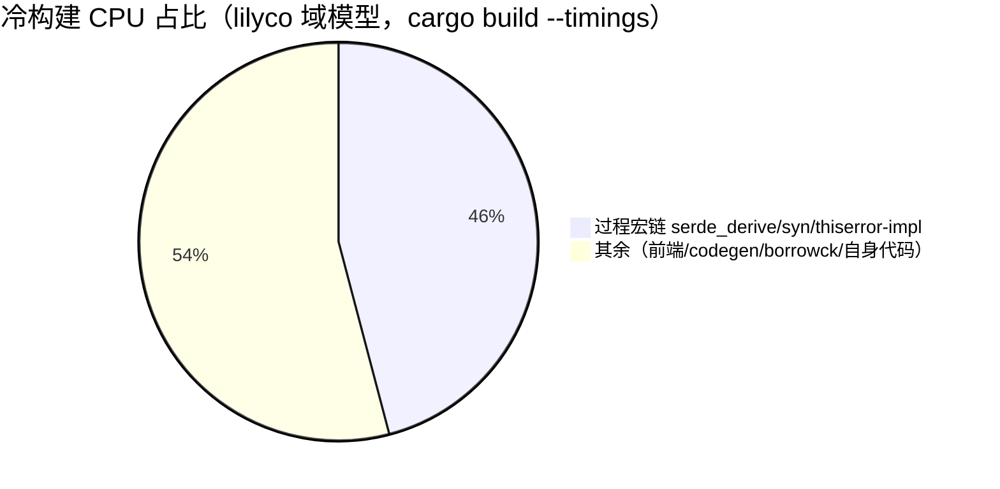
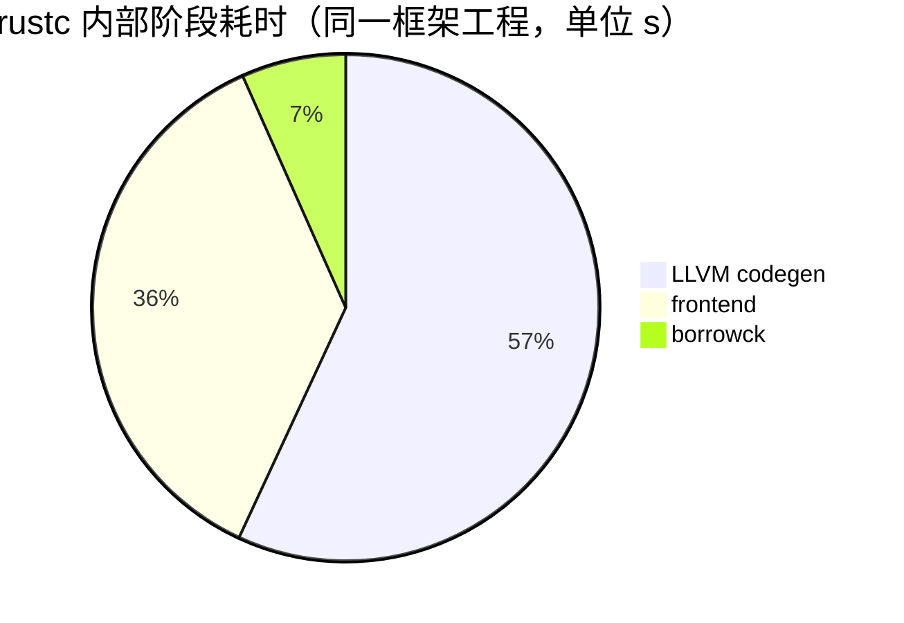

# 编译时间占比分析报告

> 全部数字来自本仓库已落地的实测（`docs/00-experiment-log.md` 台账 E1~E12 + 各专题报告 R1~R9），
> 同机、同 rustc、同口径。本文把散落在各处的「编译时间都花在哪了 / 各种杠杆各占多少」汇总成一份视图。
>
> 环境：Windows / rustc 1.98.1 / cargo 1.98.1 / nightly 1.100 · MSVC 14.51 · LLVM 22.1.8
> 日期：2026-09-30 ~ 2026-10-01

---

## TL;DR

1. **编译慢的根因不是「编译器慢」，是「依赖多 + 编译量大」。** 过程宏链（serde_derive / syn / thiserror-impl）独占 **45.9%** 的 CPU，且铺在**串行关键路径**上——并行度救不了。`borrowck` 只是伪瓶颈（**2.9%**）。
2. **最大杠杆是减「编译量」**：`default-members` 一行省 **56%** 的包（865→379）；`cargo check` 替 `cargo build` 快 **1.75~1.87×**。
3. **减「编译产物」的刀（关 PDB / 去 staticlib）对速度零收益**——速度和体积是两个不重叠的战场，混着做会互相抵消。

---

## 一、编译时间解剖：钱花在哪了（占比）

三张互补的视图，来自三个不同口径的测量。**不要相加**——它们量的是不同的东西。

### 1.1 过程宏链占 CPU 的 45.9%（最该砍的头）

来源：`docs/RUST_NOSTD_VERDICT.md`，lilyco 域模型 `cargo build --timings`，A 组总 CPU 22.2 s。

逐 crate 的占比（节选自该报告账单）：

| crate | 耗时 | 占该次构建 % | 是否在过程宏链上 |
|---|---|---|---|
| serde_derive | 2.70 s | 12.2 % | ✅ |
| serde_core | 2.20 s | 9.9 % | ✅ |
| syn 3.0.6 | 1.70 s | 7.7 % | ✅ |
| serde_json | 1.70 s | 7.7 % | ✅ |
| thiserror-impl | 1.30 s | 5.9 % | ✅ |
| serde_core build-script | 1.00 s | 4.5 % | （build script） |
| zmij（serde_json 浮点格式化依赖） | 0.90 s | 4.1 % | — |
| memchr | 0.80 s | 3.6 % | — |
| lc_dep（自身代码） | 0.80 s | 3.6 % | — |
| **过程宏链合计** | **10.20 s** | **45.9 %** | |

> ⚠️ 关键机制：wall 时间由**串行关键路径**决定，而过程宏链（proc-macro2 build → syn → serde_derive → serde → …）正好铺在这条路径上。
> 所以即便 B 组把 thiserror-impl 拔掉、CPU 总量降 33%（22.2→14.8 s），**wall 时间纹丝不动**——并行度救不了串行链。
> 只有把整条链拔掉（E 组，无过程宏），wall 才真正掉下来。

### 1.2 另一个口径：首编的「六成」是 syn + 4 个过程宏

来源：`docs/RUST_FAST_SMALL.md` §二，带 serde/clap/thiserror 的框架工程（首编 ~38 s）。

- `syn 3.0.6`（18.1 s）+ `syn 2.0.119`（12.8 s）+ 4 个过程宏（37.7 s）≈ **首编的六成（~60 %）**
- 依赖归零之后，rustc 的活只剩「编 1 个文件 + 链接」，冷构建掉到 **0.4 s 档**（三个数量级差距）。
- 结论：**参数层没油水，油水全在依赖数量上。**

### 1.3 rustc 内部阶段（编译一个 crate 时的时间切分）

来源：`docs/RUST_FAST_SMALL.md` §二，同框架工程。这是「依赖编完之后、编自身代码」的阶段拆分：

- **LLVM codegen（43.6 s）> frontend（27.9 s）**——优化/机器码生成比解析类型更贵。
- **borrowck 只有 5.1 s（2.9 %）**——之前一直盯错了对象。（`docs/XMAKE_VS_RUST_PIPELINE.md` 在 xmake 对标里也得到一致结论：borrowck 仅占 0.031 s / 12%。）

---

## 二、各种报告对「编译时间占比」的贡献

本仓库 12 个实验（E1~E12）+ 9 份专题报告（R1~R9），各自回答了「占比」这张大图里的一块：

| 报告 | 测了什么 | 揭示的「占比」事实 |
|---|---|---|
| **E1** · `final.json` | Rust vs C vs Go 裸程序（汇编层 + 全流程） | 依赖归零后 Rust 冷构建 **0.4 s 档**，比 C/xmake 快 2.4× —— 证明「慢」来自依赖，不是编译器 |
| **E2** · `_bench.json` | Tauri 四配置基准 | 默认 debug `target/` **4,135 MB**；最小 Tauri 项目就 **291 个 crate**（业务代码规模无关） |
| **E3–E6** · `_bench_1g*.json` | 冲 1 GB 四波 | 4,135 → **953 MB**（−77%）：`/DEBUG:NONE` 省 179 MB、去 `staticlib`/`cdylib` 省 183 MB、依赖 `opt-level="z"` 省 113 MB |
| **E7** · `_bench_sccache.json` | sccache 真实收益 | 全命中重建 **1.84×**；命中率天花板 **57.4%**（剩余 43% 是 build script + 过程宏，**永不命中** → 硬底） |
| **E8** · `_bench_opt.json` | 依赖 opt-level 五组标定 | `z` 比 `1` **更快且小 55 MB**；`2` 双输最差；混合方案无效 |
| **E9** · `_cgu.json` | lilyco 真实测量 | `default-members` 省 **56%** 包（865→379）；`codegen-units` 16 vs 256 是**否定结果**（16 反而略好，别去修） |
| **E10** · `speed_cards*.json` | 三张牌（lld / 并行前端 / cranelift） | cranelift 冷 `build` **−31%**、增量 `build` −17%（但冷 `check` **+20%**）；lld / 并行前端都是噪声 |
| **E11** · `ip-c` `ip-bare` | Rust vs xmake 三层对标 | 可比规模 Rust 全面超越（冷 0.36×、增量 0.59×、no-op 0.29×）；但真实项目绝对冷构建赢不了——那是**编译量**差异 |
| **E12** · `dynproof/` `cargo-xmake/` | cargo-xmake 去泛型单变量对照 | 合成工程单态化 **−47.6%**；真实工程本地仅 **0.04%**（9616 副本里 8 份在自身代码）——dynify 在该类项目不值得做 |
| **R1** `XMAKE_VS_RUST_PIPELINE` | 汇编层 + 全流程对标 | 确认 borrowck 非瓶颈（12%） |
| **R2** `TAURI_DEV_EFFICIENCY_PLAN` | Tauri 开发效率方案 | 磁盘/速度权衡的完整配置 |
| **R3** `TAURI_1GB_ACHIEVED` | 达成 1 GB 实录 | 各刀收益的可复现明细 |
| **R4** `RUST_NOSTD_VERDICT` | no_std 值不值 | **`#![no_std]` 对速度/体积≈零影响**（B vs C 仅 −1.4% 噪声，exe 字节数完全相同） |
| **R5** `NO_STD_LIBS` | no_std 库替代清单 | 可替换依赖的下载量实测 |
| **R6** `NOSTD_LIB_REPLACEMENT_VERDICT` | 库替换结论 | 换库砍 137 行但**冷构建 6.6× 慢**、**体积一字不变** |
| **R7** `CAN_MATCH_C` | 能否对标 C 体积 | 体积分水岭：极限 Rust 7,168 B < C 13,824 B；常规 Rust 13.4× |
| **R8** `TUI_NOSTD_CORRECTION` | 一次误判纠正 | ratatui-core 已 `#![no_std]`，tui 渲染层可无 std |
| **R9** `RUST_FAST_SMALL` | 速查 | §二 的编译时间解剖账单（本文 §一 的主要来源） |
| **docs/01-methodology** | 方法论 | 速度 vs 体积的杠杆不重叠；五层阶梯决策 |

> 一句话：**E1/E12 证明「慢在依赖与编译量」，E9 给出减编译量的最大杠杆（56%），E7/E10 给出编译器侧的有限提速（sccache 1.84× / cranelift −31%），E2/E3–E6 给出减产物的刀（对速度零收益）。**

---

## 三、提速杠杆的收益占比（能省多少）

按「对真实项目的内环速度」排序，**赚钱的只有前三个**：

| 杠杆 | 收益 | 性质 | 来源 |
|---|---|---|---|
| **`default-members`** | 编译包数 **−56%**（865→379） | 减编译量 | E9 / `docs/02` |
| **`cargo check` 替 `cargo build`** | 冷 **1.87×**、增量 **1.75×** | 减编译量（不跑 codegen） | `docs/03` |
| **`incremental = true`** | 保住内环速度 | 减编译量 | `docs/03` |
| cranelift（nightly, dev-only） | 冷 `build` **−31%**、增量 `build` −17% | 编译器侧 | E10 |
| sccache（按需 `RUSTC_WRAPPER=sccache`） | 上限 **1.84×**，命中率天花板 57.4% | 编译器侧缓存 | E7 |
| 依赖 `opt-level = "z"` | 比 `1` 快且小 55 MB（体积+冷构建双赢） | 减产物+冷构建 | E8 |
| **`/DEBUG:NONE`** | 省 179 MB | **减产物，对速度零收益** | E3–E6 |
| `debug = false` / 去 `staticlib`/`cdylib` / `strip` | 省磁盘 | **减产物，对速度零收益** | E3–E6 |
| `codegen-units` 16 vs 256 | **否定结果**（16 略好，别去修） | — | E9 |
| lld 链接器 / 并行前端 | **无效**（噪声） | — | E10 |

> 反直觉但实测成立的两条：
> - **`opt-level = "z"` 比 `1` 更快且更小**——`z` 跳过向量化/循环展开等昂贵 pass。
> - **`/DEBUG:NONE`、`debug=false` 这类「体积刀」对速度零收益**，但也不拖慢；唯一双赢项是依赖 `opt-level="z"`。

---

## 四、结论与行动顺序

1. **先量，别猜**（`docs/01` 第 0 层）。用 `cargo build --timings` 看过程宏链占比——大概率它吃掉了你的 45%+。
2. **减编译量优先**：`default-members`（一行 −56%）→ `cargo check` 替 `build` → 留 `incremental`。
3. **编译器侧有限提速**：cranelift（仅 dev、不写进 `Cargo.toml`、不支持 fat LTO）、sccache 按需开（别写进默认配置——web-sys 长命令行会撞 Windows 32767 上限导致 `cargo build --workspace` 失败）。
4. **减产物 ≠ 提速**：`/DEBUG:NONE`、去 `staticlib`/`cdylib` 只省磁盘，想要速度别在这上面花时间。
5. **别盯 borrowck**：它只占 2.9%，是伪瓶颈。
6. **dynify 这类源码变换**：在依赖/标准库占单态化大头的真实项目上收益趋近于零（本地仅 0.04%），先用 `cargo xmake audit` 看热点归谁。

---

*关联文档：`docs/01-methodology.md`（怎么想）、`docs/03-build-speed.md`（只讲速度）、`docs/05-toolchain-cards.md`（cranelift 实测）、`docs/06-cargo-xmake.md`（dynify 工具与诚实边界）、`README.md`（结论速查）。*
